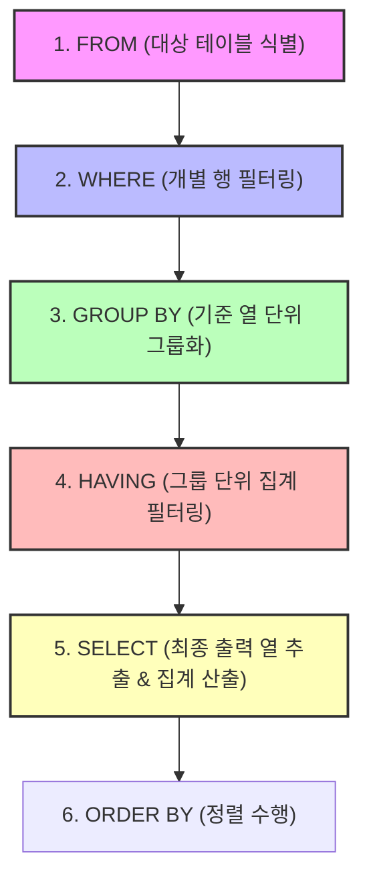
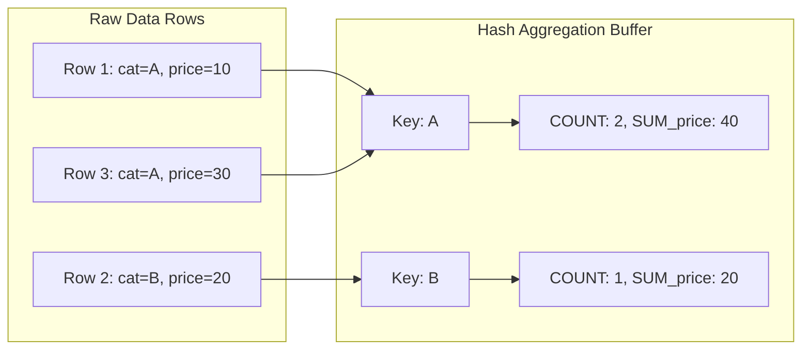

# 📘 SQL DQL 마스터 가이드: GROUP BY와 HAVING (MySQL 기준)

본 가이드는 `dql01.sql`에 포함된 기초 SQL 데이터를 분석하여, **DQL(Data Query Language)**의 핵심 요약인 **그룹핑(GROUP BY)**과 **그룹 필터링(HAVING)**을 집중적으로 다룹니다. 초심자의 비유부터 주니어 수준의 RDBMS 설계 원리, 그리고 SQLD 시험 핵심 포인트와 면접 Q&A까지 종합적으로 포함하고 있습니다.

---

## 📌 목차
1. [SQLD 핵심 요약 & GROUP BY 실행 순서](#1-sqld-핵심-요약--group-by-실행-순서)
2. [GROUP BY 절: 데이터 그룹화와 컬럼 제약 규칙](#2-group-by-절-데이터-그룹화와-컬럼-제약-규칙)
3. [HAVING 절: WHERE 절과의 동작 원리 비교](#3-having-절-where-절과의-동작-원리-비교)
4. [RDBMS의 GROUP BY 내부 처리 알고리즘](#4-rdbms의-group-by-내부-처리-알고리즘)
5. [기술 면접 대비 예상 질문 & 답변 (Q&A)](#5-기술-면접-대비-예상-질문--답변-qa)

---

## 1. SQLD 핵심 요약 & GROUP BY 실행 순서

### 💡 SQLD 시험 출제 포인트
* **GROUP BY 절을 사용할 때 SELECT 절의 컬럼 제한**: GROUP BY 절에 지정하지 않은 컬럼을 SELECT 절에서 직접(집계 함수로 감싸지 않고) 사용하면 구문 오류가 발생한다는 성질을 정확히 묻습니다.
* **WHERE 절과 HAVING 절의 필터링 타겟 분리**: 개별 행을 필터링하는 조건은 WHERE에, 그룹핑된 통계 데이터에 대한 조건은 HAVING에 위치시켜야 합니다.

### ⚙️ DQL 논리적 실행 흐름과 GROUP BY의 위치 (주니어를 위한 원리)
RDBMS가 쿼리를 해석하고 가공하는 순서에서 GROUP BY와 HAVING이 어디에 위치하는지 이해하는 것이 옵티마이저 튜닝의 기초입니다.



* **포인트**: 
  * `WHERE`는 `GROUP BY`보다 **먼저** 실행되므로, WHERE 조건으로 필터링되어 탈락한 로우는 그룹핑 대상에서 원천 배제되어 메모리 사용량을 줄여줍니다.
  * `HAVING`은 `GROUP BY` **이후**에 실행되므로, 그룹핑이 완료된 요약 성적 데이터에만 접근할 수 있습니다.

---

## 2. GROUP BY 절: 데이터 그룹화와 컬럼 제약 규칙

### 🎨 초심자를 위한 비유
* **그룹핑 (분류 바구니)**: 사과, 바나나, 포도가 무작위로 섞여 담긴 과일 상자가 있습니다. `GROUP BY 과일종류`를 실행하면, 바닥에 `[사과 바구니]`, `[바나나 바구니]`, `[포도 바구니]` 세 개를 놓고 과일들을 종류별로 바구니에 나누어 담는 작업과 같습니다.
* **집계 (바구니 요약)**: 바구니에 다 나눈 뒤, 우리는 바구니 별로 "사과 바구니의 총 가격(`SUM`)은 얼마인가?", "바나나 바구니에는 몇 개(`COUNT`)의 바나나가 들었는가?"를 계산할 수 있습니다.

### 🧪 추상화된 일반 예제
```sql
-- 1. 단일 컬럼 기준 그룹화 및 카운트
SELECT group_column, COUNT(*) AS group_count
FROM table_name
GROUP BY group_column;

-- 2. 그룹화 후 복합 집계 데이터 산출
SELECT group_column,
       COUNT(*) AS total_count,
       AVG(numeric_column) AS average_value,
       SUM(numeric_column) AS sum_value
FROM table_name
GROUP BY group_column;
```

### 🧠 주니어를 위한 원리 & SQLD 핵심
#### ⚠️ SELECT 절 지정 제한 규칙 (ONLY_FULL_GROUP_BY)
`GROUP BY` 절을 기술했을 때, `SELECT` 절에 작성할 수 있는 표현식은 엄격히 제한됩니다.

```sql
-- 잘못된 예시: SQLD 시험 및 표준 SQL 모드에서 문법 에러 유발
SELECT category, product_name, AVG(price)
FROM products
GROUP BY category;
```
* **이유**: `category`로 묶인 하나의 그룹 바구니 안에는 여러 개의 서로 다른 `product_name` 행들이 들어있습니다. RDBMS가 단 1줄의 요약된 행으로 출력해야 할 때, 이 중 어떤 상품명을 대표로 출력해야 할지 물리적으로 판정할 수 없기 때문입니다.
* **해결법**: SELECT 절에는 오직 **`GROUP BY`에 사용한 기준 컬럼** 또는 **집계 함수(`MAX`, `MIN`, `COUNT`, `AVG` 등)로 감싼 컬럼**만 명시해야 합니다.

---

## 3. HAVING 절: WHERE 절과의 동작 원리 비교

### 🎨 초심자를 위한 비유
* **WHERE (개별 검사)**: 학교 동아리 축제에 참가할 학생을 뽑을 때, 먼저 "키 170cm 이하인 학생"은 입장 금지시키는 개별 검문소입니다.
* **HAVING (팀별 심사)**: 개별 검문소를 통과한 학생들을 5명씩 한 조(Group)로 묶은 뒤, 조별로 심사위원이 채점을 하고 **"우리 조원들의 평균 키가 175cm 이상인 조만 통과"** 시키는 단체 심사대입니다. 개별 학생의 키가 170cm이 넘어도, 조 평균이 175cm 미만이면 조원 전체가 탈락하게 됩니다.

### 🧪 추상화된 일반 예제
```sql
-- 그룹화된 결과 셋 중 통계적 요건을 충족하는 그룹만 필터링
SELECT group_column, AVG(numeric_column) AS group_avg
FROM table_name
GROUP BY group_column
HAVING AVG(numeric_column) > 100000;
```

### 🧠 주니어를 위한 원리 & SQLD 핵심
#### WHERE vs HAVING 비교 요약표

| 구분 | WHERE 절 | HAVING 절 |
| :--- | :--- | :--- |
| **적용 대상** | 개별 행(Row) 단위 필터링 | `GROUP BY` 완료 후의 그룹(Group) 단위 필터링 |
| **수행 시점** | `GROUP BY` 연산 수행 **전** | `GROUP BY` 연산 완료 **후** |
| **집계 함수 사용** | **불가능** (예: `WHERE AVG(price) > 50` ➡️ **Syntax Error**) | **가능** (예: `HAVING AVG(price) > 50` ➡️ **정상 작동**) |
| **인덱스 활용** | 조건 컬럼에 B-Tree 인덱스가 걸려있으면 **인덱스 스캔 가능** | 그룹화 데이터이므로 **인덱스 활용 불가** (Full Scan 후 연산) |

> [!IMPORTANT]
> **성능 튜닝의 핵심**: 그룹화와 무관하게 개별 로우 수준에서 걸러낼 수 있는 필터 조건(예: `WHERE category = 'Electronics'`)을 귀찮다는 이유로 `HAVING category = 'Electronics'`에 배치하면 RDBMS는 전체 테이블 데이터를 메모리에 로드해 그룹핑한 후 걸러내므로 메모리와 CPU 소모가 커집니다. 반드시 WHERE 절로 먼저 데이터를 축소시켜 조기 필터링(Early Filtering)을 수행해야 합니다.

---

## 4. RDBMS의 GROUP BY 내부 처리 알고리즘

### 🧠 주니어를 위한 원리

RDBMS 내부에서 GROUP BY를 처리하기 위해 옵티마이저가 수립하는 대표적인 실행 계획 알고리즘은 두 가지가 있습니다.



1. **임시 테이블 및 해시 알고리즘 (Hash Aggregation)**
   * DBMS는 메모리 영역에 임시 해시 테이블(Hash Table)을 생성합니다.
   * 입력 로우를 하나씩 스캔하며 GROUP BY 기준 컬럼을 해시 키(Hash Key)로 매핑하고, 버퍼 공간 내 집계 필드(COUNT, SUM 등) 정보를 가산해 나갑니다.
   * 정렬되지 않은 대용량 데이터에서 속도가 빠릅니다. **MySQL 8.0부터는 임시 정렬을 수행하지 않고 이 해시 그룹 방식을 기본으로 채택하여 성능을 최적화**했습니다.
2. **정렬 알고리즘 (Sort Aggregation)**
   * GROUP BY 기준 컬럼으로 테이블 데이터를 정렬한 다음, 순차적으로 정렬된 값을 읽어가며 연속된 데이터의 값이 바뀔 때(Group Boundary) 집계를 수행하고 다음 그룹 버퍼를 형성합니다.
   * 이미 인덱스에 의해 데이터가 정렬되어 있을 때 극도의 효율을 보입니다.

---

## 5. 기술 면접 대비 예상 질문 & 답변 (Q&A)

### Q1. WHERE 절과 HAVING 절의 내부 동작 원리 차이점과 이에 따른 쿼리 성능 튜닝 방안을 설명해 주세요.
* **답변**:
  * **동작 시점**: WHERE 절은 디스크/버퍼 캐시에서 데이터를 읽어와 그룹핑(GROUP BY)을 시작하기 전에 실행되는 행 단위 필터이고, HAVING 절은 그룹화 처리가 끝난 후 만들어진 그룹 요약 레코드를 필터링하는 조건절입니다.
  * **성능 관점**: 집계 함수를 이용하지 않는 조건은 반드시 WHERE 절에 배치해야 합니다. WHERE 절에서 조건에 맞지 않는 레코드를 사전에 누락시키면, GROUP BY 연산을 위해 할당해야 할 정렬 메모리 및 해시 버퍼 사용량이 현격히 줄어들기 때문입니다. HAVING 절에 개별 필터 조건을 달면 불필요한 테이블 전수 그룹화 연산 비용이 추가로 낭비됩니다.

---

### Q2. SQL GROUP BY 절을 사용했을 때 SELECT 절에 `GROUP BY` 기준 컬럼 외의 단일 컬럼을 직접 기재하면 구문 에러가 유발되는 컴퓨터 과학적 배경을 명확히 말해 주세요.
* **답변**:
  * RDBMS가 특정 열을 기준으로 행들을 그룹화하면, 결과적으로 1개의 그룹 키에 매핑되는 복수의 데이터 행들이 가상 버퍼에 묶입니다.
  * 만약 집계 연산 없이 일반 컬럼(예: `product_name`)을 SELECT에 기재하면, 하나의 대표 출력 셀에 여러 행의 값(예: '아이폰 15', '노이즈캔슬링 헤드폰') 중 어떤 값을 대표로 뿌려줄지 RDBMS가 1:1 관계 규칙을 충족할 수 없으므로 무결성 오류를 방지하기 위해 문법 에러(Syntax Error)를 반환합니다.
  * 따라서 표준 SQL 규격상 SELECT 절에는 오직 GROUP BY에 선언된 그룹 기준 키 컬럼 자체나, 여러 개의 로우 값을 1개의 스칼라 값으로 단일화할 수 있는 집계 함수 감싸기 형태만 허용합니다.

---

### Q3. MySQL 8.0 버전 이전과 이후의 `GROUP BY` 기본 정렬 동작 차이와 이것이 성능에 미친 영향을 설명해 주세요.
* **답변**:
  * MySQL 5.7 이하 버전에서는 `GROUP BY`가 실행되면 옵티마이저가 묵시적으로 정렬 연산(Implicit Sorting)을 동반하여 오름차순으로 결과를 자동 정렬해 출력해 주었습니다.
  * 그러나 이 묵시적 정렬은 정렬이 불필요한 단순 집계 쿼리 상황에서도 불필요하게 Filesort 연산을 강제해 정렬 리소스를 소모시키는 주범이었습니다.
  * MySQL 8.0 버전부터는 묵시적 정렬 연산 기능이 완전 제거되어 정렬을 보장하지 않는 대신 해시 집계(Hash Aggregation)로 대체되어 더 효율적인 속도를 보입니다. 따라서 MySQL 8.0 이상에서 정렬된 그룹 데이터가 필수적이라면 반드시 `ORDER BY` 구문을 명시적으로 명문화해 주어야 합니다.

---

### Q4. 대규모 거래 이력 테이블에서 특정 상점별 총 결제 금액(`SUM(price)`)을 집계하되, 총합이 1,000만 원 이상인 상점들만 선별하는 SQL을 최적화하여 설계하는 원칙을 설명해 주세요.
* **답변**:
  * '상점별 총 결제 금액'은 개별 행의 데이터가 아니라 그룹핑 이후의 요약 값이므로 이 조건은 `HAVING SUM(price) >= 10000000` 절에 배치해야 합니다.
  * 하지만 이 쿼리를 효율적으로 튜닝하기 위해서는 WHERE 절과의 유기적 연계가 필요합니다. 만약 검색 대상 기간이 고정되어 있다면(예: 최근 3개월), `WHERE pay_date >= DATE_SUB(NOW(), INTERVAL 3 MONTH)` 필터로 대상 데이터의 총 모수를 1차로 솎아내어 메모리 그룹핑 연산 비용을 축소시켜야 합니다.
  * 추가적으로 조인이나 테이블 크기에 맞춰 `shop_id` 컬럼에 인덱스를 두어, 옵티마이저가 해시 맵 임시 테이블 대신 인덱스 순서대로 로우를 수집하는 Sort Avoidance 정렬 방식을 탈 수 있도록 B-Tree 인덱스를 고려해야 합니다.
