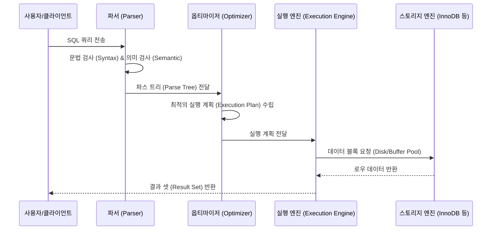
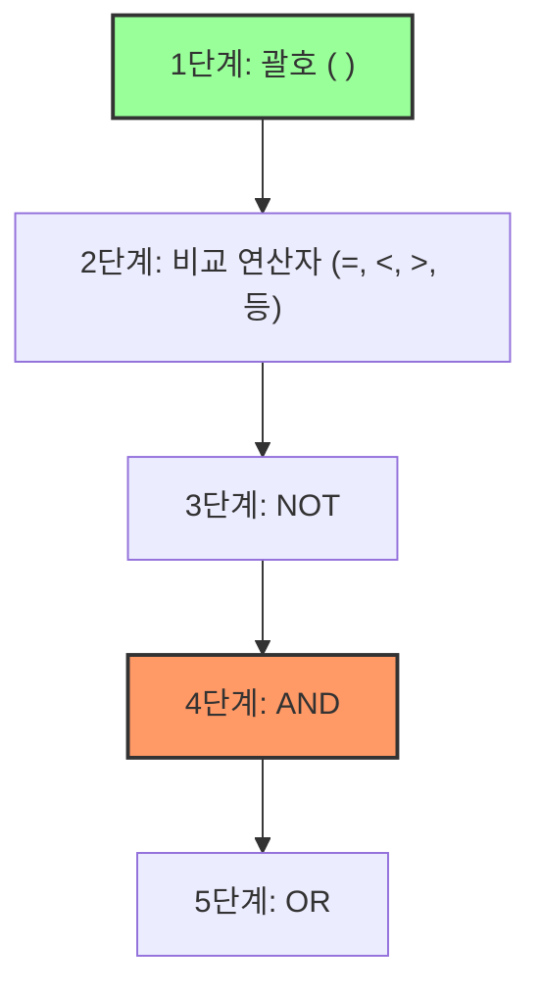

# 📘 SQL DQL 기초 마스터 가이드 (MySQL 기준)

본 가이드는 `step1.sql`에 포함된 기초 SQL 데이터를 분석하여, **DQL(Data Query Language, 데이터 질의어)**을 중심으로 작성되었습니다. SQL을 처음 접하는 초심자부터 원리를 파악하려는 주니어 개발자, 그리고 SQLD(SQL 개발자) 자격증 및 기술 면접을 준비하는 취업 준비생까지 모두 학습할 수 있도록 단계별로 구성되어 있습니다.

---

## 📌 목차
1. [SQLD 핵심 요약 & DQL 아키텍처](#1-sqld-핵심-요약--dql-아키텍처)
2. [SELECT & FROM: 데이터의 프로젝션과 소스](#2-select--from-데이터의-프로젝션과-소스)
3. [Alias & DISTINCT: 별칭 지정과 중복 제거](#3-alias--distinct-별칭-지정과-중복-제거)
4. [WHERE 절을 통한 필터링과 NULL 제어](#4-where-절을-통한-필터링과-null-제어)
5. [논리 연산자(AND, OR, NOT)와 우선순위 법칙](#5-논리-연산자and-or-not와-우선순위-법칙)
6. [기술 면접 대비 예상 질문 & 답변 (Q&A)](#6-기술-면접-대비-예상-질문--답변-qa)

---

## 1. SQLD 핵심 요약 & DQL 아키텍처

### 💡 SQLD 시험 출제 포인트
* **SQL 문장의 구성**: DQL(SELECT)은 넓은 의미에서 DML(데이터 조작어)에 포함됩니다. SQLD 시험에서는 데이터 조회의 기본인 SELECT문의 논리적 수행 순서를 정확히 알고 있는지 묻는 문제가 매회 출제됩니다.
* **NULL의 정의와 연산**: RDBMS에서 `NULL`은 0이나 공백 문자(`''`)가 아닌 **'알 수 없음(Unknown)'** 혹은 **'정의되지 않은 값'**을 의미합니다. NULL이 포함된 연산의 결과는 항상 NULL(비교 연산시 UNKNOWN)이 된다는 규칙을 반드시 숙지해야 합니다.

### ⚙️ RDBMS의 SQL 처리 구조 (주니어를 위한 원리)
작성한 SQL 명령어가 디스크에 있는 실제 데이터 블록을 읽어 사용자에게 화면으로 출력되기까지의 내부 프로세스입니다.



* **파서 (Parser)**: SQL의 철자, 괄호 짝 등 문법적 오류(Syntax Error)를 확인하고, 테이블이나 컬럼이 실제 존재하는지(Semantic Error) 확인하여 내부적인 트리 구조를 생성합니다.
* **옵티마이저 (Optimizer)**: 옵티마이저는 RDBMS의 '두뇌'입니다. 데이터를 찾아가는 여러 방법(인덱스 스캔, 풀 테이블 스캔 등) 중 비용(Cost)이 가장 적게 드는 최적의 **실행 계획(Execution Plan)**을 수립합니다.
* **실행 엔진 & 스토리지 엔진**: 수립된 계획에 따라 스토리지 엔진(InnoDB 등)에서 메모리 버퍼 캐시 혹은 디스크 파일로부터 필요한 데이터 블록을 메모리로 로드한 뒤 필터링 등의 연산을 수행합니다.

---

## 2. SELECT & FROM: 데이터의 프로젝션과 소스

### 🎨 초심자를 위한 비유
* **FROM (소스)**: 거대한 **서류 보관 창고(Database)** 안에 여러 칸의 **서류 캐비닛(Table)**이 있습니다. 쿼리를 보낼 때 가장 먼저 "어떤 캐비닛(`FROM`)을 열어서 서류를 꺼낼 것인가?"를 지정하는 단계입니다.
* **SELECT (프로젝션)**: 지정한 캐비닛에서 꺼낸 서류 봉투 안에는 이름, 전화번호, 주소 등 수많은 정보가 적힌 칸이 있습니다. `SELECT`는 복사기 앞에서 **"내가 복사해서 받아 가고 싶은 특정 열(Column)들만 선택하는 과정"**입니다. 만약 전체 열이 필요하다면 별표(`*`)라는 마스터키를 사용합니다.

### 🧪 추상화된 일반 예제
```sql
-- 특정 열(Column)만 선택하여 조회하는 표준 형태
SELECT column_name_1, column_name_2
FROM table_name;

-- 테이블의 모든 열을 조회하는 형태 (와일드카드 '*' 사용)
SELECT *
FROM table_name;
```

### 🧠 주니어를 위한 원리 & SQLD 핵심 (논리적 쿼리 실행 순서)
작성하는 SQL 쿼리의 텍스트 순서와 데이터베이스 엔진 내부에서 처리하는 **논리적 순서**는 다릅니다.

```mermaid
flowchart TD
    subgraph 작성 순서 (Syntax Order)
        A["1. SELECT"] --> B["2. FROM"]
    end
    subgraph 실제 실행 순서 (Execution Order)
        C["1. FROM"] --> D["2. SELECT"]
    end
    style C fill:#f9f,stroke:#333,stroke-width:2px
    style D fill:#bfb,stroke:#333,stroke-width:2px
```

* **이유**: DBMS는 데이터를 가져올 대상 테이블(`FROM`)을 먼저 지정하여 메모리에 로드하고 데이터를 식별한 후에야, 비로소 그 행들 중에서 명시된 컬럼(`SELECT`)을 추려내는 작업(Projection)을 할 수 있습니다. 
* **성능 팁**: `SELECT *`는 데이터베이스 카탈로그(딕셔너리)를 추가로 조회하여 테이블 구조를 파악해야 하므로 리소스를 더 소모하며, 불필요한 네트워크 대역폭을 낭비하므로 실제 운영 개발 환경에서는 지양하고 필요한 컬럼만 명시해야 합니다.

---

## 3. Alias & DISTINCT: 별칭 지정과 중복 제거

### 🎨 초심자를 위한 비유
* **Alias (AS, 별칭)**: '홍길동'이라는 사원의 사원 번호 컬럼명이 시스템 내부적으로 `EMP_NO_100_VAL`처럼 복잡하게 되어 있을 때, 출력 보고서에서 보기 좋게 **'사원번호'**라는 임시 명찰을 달아주는 것입니다. 본래 이름(원본 테이블 구조)은 변하지 않습니다.
* **DISTINCT (중복 제거)**: 장바구니에 `[사과, 사과, 바나나, 사과, 바나나]`가 담겨있을 때, 중복을 다 없애고 **"장바구니에 들어있는 과일의 종류만 알려줘"**라고 하여 `[사과, 바나나]`라는 고유 목록만 뽑아내는 것입니다.

### 🧪 추상화된 일반 예제
```sql
-- 1. AS를 이용한 컬럼 별칭 부여
SELECT column_name AS alias_name
FROM table_name;

-- 2. 띄어쓰기나 특수문자가 들어간 별칭 정의 시 표준 기호 사용 (쌍따옴표)
SELECT column_name AS "alias name with spaces"
FROM table_name;

-- 3. 특정 컬럼의 중복 데이터 제거
SELECT DISTINCT column_name
FROM table_name;
```

### 🧠 주니어를 위한 원리 & SQLD 핵심
#### 별칭(Alias) 지정 규칙
1. `AS` 키워드는 생략할 수 있으나 가독성을 위해 명시하는 것이 좋습니다.
2. SQLD 표준 및 ANSI SQL 기준에 따라, 별칭에 **공백, 특수문자, 대소문자 구분**이 필요할 때는 반드시 **쌍따옴표(`" "`)**로 감싸야 합니다. (MySQL에서는 작은따옴표`''`나 백틱(`` ` ``)도 유연하게 지원하지만 시험 대비를 위해서는 쌍따옴표로 외우는 것이 기본입니다.)

#### DISTINCT의 작동 원리
`DISTINCT`는 내부적으로 쿼리 결과를 **정렬(Sort)** 하거나 **해시(Hash)** 알고리즘을 사용해 임시 메모리 버퍼에서 중복을 비교하며 제거합니다. 

| 구분 | DISTINCT | ALL (기본값) |
| :--- | :--- | :--- |
| **의미** | 결과 셋에서 중복된 행을 제거하고 고유한 값만 출력 | 중복을 허용하여 쿼리 조건에 맞는 모든 데이터를 출력 |
| **성능 부하** | 중복 비교를 위한 정렬/해싱 연산 발생 (데이터가 많을 시 성능 저하 가능) | 추가 연산 없이 조회된 로우를 즉시 반환 |
| **다중 컬럼 지정** | `SELECT DISTINCT col1, col2` -> col1과 col2의 **조합** 전체가 중복인 것을 제거 | 해당 없음 |

> [!WARNING]
> **SQLD 빈출 함정**: `DISTINCT`는 바로 뒤에 오는 단 하나의 컬럼에만 적용되는 것이 아니라, **SELECT 절에 나열된 모든 컬럼의 조합**을 기준으로 중복을 판별합니다. 즉, `SELECT DISTINCT col1, col2`는 `col1` 값만 중복된다고 지워지는 것이 아니라, `(col1, col2)` 순서쌍 자체가 일치해야 제거됩니다.

---

## 4. WHERE 절을 통한 필터링과 NULL 제어

### 🎨 초심자를 위한 비유
* **WHERE (필터)**: 채용 과정에서 서류 전형을 진행하는 것과 같습니다. 지원자 전체 리스트(`FROM`) 중에서 "토익 800점 이상(`WHERE` 조건)"이라는 채점 기준표를 들이밀어, 기준을 통과한(결과가 `TRUE`인) 지원자들만 면접 대상자(`Result Set`)로 통과시키는 필터입니다.
* **NULL (알 수 없음)**: 만약 이력서의 주소 칸이 비어있다면(`NULL`), 이 지원자가 서울에 사는지(주소 = '서울') 물었을 때, "맞다(True)" 혹은 "아니다(False)"라고 확실히 대답할 수 없습니다. 오직 **"이 항목은 비어있는 상태인가? (IS NULL)"**라고만 물어볼 수 있습니다.

### 🧪 추상화된 일반 예제
```sql
-- 1. 기본 WHERE 필터 적용
SELECT column_name_1, column_name_2
FROM table_name
WHERE filter_column = 'target_value';

-- 2. NULL 값을 정상적으로 찾기 위한 올바른 예시
SELECT column_name_1
FROM table_name
WHERE nullable_column IS NULL;

-- 3. NULL이 아닌 값을 정상적으로 찾기 위한 예시
SELECT column_name_1
FROM table_name
WHERE nullable_column IS NOT NULL;
```

### 🧠 주니어를 위한 원리 & SQLD 핵심
* **수행 순서 확장**: `FROM` -> `WHERE` -> `SELECT`
  * RDBMS는 `FROM`에서 명시된 디스크 블록을 스캔하면서 `WHERE`에 지정된 필터 조건식을 **각 행마다 실행하여 판별**합니다. 그 결과 조건의 평가 값이 참(`TRUE`)인 행만 골라 메모리에 남기고, 마지막에 `SELECT`를 통해 화면에 표출할 열만 잘라냅니다.
  * **이 때문에 `SELECT` 절에서 지정한 별칭(Alias)은 `WHERE` 절에서 참조할 수 없습니다.** RDBMS가 `WHERE` 절을 연산할 시점에는 아직 `SELECT` 절을 읽지도 않았기 때문입니다.

#### SQL 3-Valued Logic (3치 논리)
SQLD 시험의 단골 고난도 유형인 **NULL과의 비교 연산** 표입니다. SQL은 `TRUE`, `FALSE` 외에 `UNKNOWN`이라는 제3의 논리값을 가집니다.

| 연산식 | 평가 결과 | 쿼리 통과 여부 |
| :--- | :--- | :--- |
| `WHERE num_column = NULL` | **UNKNOWN** | ❌ 탈락 (결과 반환 안 됨) |
| `WHERE num_column != NULL` | **UNKNOWN** | ❌ 탈락 (결과 반환 안 됨) |
| `WHERE num_column IS NULL` | **TRUE** (해당 로우가 NULL인 경우) | ⭕ 통과 |
| `WHERE NULL + 100 > 50` | **UNKNOWN** (산술 연산 결과 자체가 NULL이 됨) | ❌ 탈락 |

> [!IMPORTANT]
> NULL과 일반 값의 비교 연산(예: `=`, `<>`, `>`, `<`)은 항상 `UNKNOWN` 논리값을 발생시키며, `WHERE` 절은 오직 최종 평가 결과가 **참(TRUE)**인 데이터만 통과시킵니다. 따라서 NULL 비교는 기호 대신 반드시 `IS NULL` 또는 `IS NOT NULL` 키워드를 사용해야 합니다.

---

## 5. 논리 연산자(AND, OR, NOT)와 우선순위 법칙

### 🎨 초심자를 위한 비유
* **우선순위 (괄호의 중요성)**:
  * 마트에서 엄마가 심부름을 시켰습니다: **"초코유리병이나 딸기유리병 중에서 뚜껑이 빨간색인 것으로 사 와."**
  * 이를 SQL 조건으로 생각 없이 적으면 `우유 = '초코' OR 우유 = '딸기' AND 뚜껑 = '빨간색'`이 됩니다.
  * 하지만 수학에서 곱셈이 덧셈보다 먼저이듯, SQL에서도 `AND`가 `OR`보다 힘이 쎕니다. 따라서 컴퓨터는 이를 `초코유유` 혹은 `(딸기유유이면서 빨간 뚜껑)`인 것으로 해석해 버립니다.
  * 결국 뚜껑 색 상관없이 모든 초코 우유를 장바구니에 담아 가 엄마에게 혼나게 됩니다. 올바른 장보기를 위해서는 괄호 `(초코 OR 딸기) AND 빨간색`으로 정확히 묶어 우선순위를 지정해야 합니다.

### 🧪 추상화된 일반 예제
```sql
-- 1. 우선순위에 주의해야 하는 조건식 (OR가 AND보다 나중에 수행됨)
SELECT *
FROM table_name
WHERE category = 'Electronics' 
   OR stock_quantity >= 100 
  AND price >= 500000;

-- 2. 괄호()를 통해 명시적으로 우선순위를 강제한 조건식
SELECT *
FROM table_name
WHERE (category = 'Electronics' OR stock_quantity >= 100) 
  AND price >= 500000;
```

### 🧠 주니어를 위한 원리 & SQLD 핵심
SQL에서 `WHERE` 조건절에 여러 연산자가 혼합되어 있을 때 연산이 수행되는 엄격한 우선순위 규칙이 존재합니다.



#### 연산자 우선순위 요약표
| 순위 | 연산자 | 설명 |
| :---: | :--- | :--- |
| **1** | `( )` | 최우선으로 평가되는 괄호 |
| **2** | 비교 연산자 및 SQL 연산자 | `=`, `>`, `<`, `BETWEEN`, `IN`, `LIKE`, `IS NULL` 등 |
| **3** | `NOT` | 논리부정 |
| **4** | `AND` | **논리곱 (두 조건이 모두 참이어야 함)** |
| **5** | `OR` | **논리합 (두 조건 중 하나라도 참이면 됨)** |

#### SQL 실무/시험 예시 분석
`step1.sql` 파일의 예제 쿼리는 다음과 같습니다.
```sql
WHERE category = 'Electronics' OR stock_quantity >= 100 AND price >= 500000;
```
1. `AND` 연산이 `OR` 연산보다 먼저 결합하므로, 괄호가 적용되지 않은 이 식은 다음과 같이 해석됩니다.
   $$\text{category = 'Electronics'} \quad \mathbf{OR} \quad (\text{stock\_quantity} \ge 100 \quad \mathbf{AND} \quad \text{price} \ge 500000)$$
2. 따라서 조회되는 대상은:
   - 카테고리가 `'Electronics'`인 모든 상품 (재고나 가격 무관)
   - 혹은, 재고가 100개 이상이면서 동시에 가격이 500,000원 이상인 상품들
3. 만약 기획 의도가 "카테고리가 'Electronics'이거나 재고가 100개 이상인 상품 중에서, 가격이 500,000원 이상인 것"이었다면 괄호를 적용하여 `WHERE (category = 'Electronics' OR stock_quantity >= 100) AND price >= 500000` 로 변경해야 올바른 결과가 나옵니다.

---

## 6. 기술 면접 대비 예상 질문 & 답변 (Q&A)

### Q1. SQL 문의 '작성 순서(Syntax Order)'와 데이터베이스 내부의 '논리적 실행 순서(Logical Order)'를 차이점과 이유를 들어 설명해 주세요.
* **답변**: 
  * SQL은 사람이 읽고 쓰기 편하게 하기 위해 `SELECT -> FROM -> WHERE -> GROUP BY -> HAVING -> ORDER BY` 순서로 작성하도록 설계되어 있습니다.
  * 그러나 실제 DBMS 엔진 내부에서 연산할 때의 논리적 실행 순서는 **`FROM -> WHERE -> GROUP BY -> HAVING -> SELECT -> ORDER BY`** 순으로 진행됩니다.
  * **이유**: 데이터를 추출하려면 가장 먼저 연산 대상 테이블(데이터 소스)이 메모리에 로드되어야 하므로 `FROM` 절이 첫 번째입니다. 그 후 필터링(`WHERE`), 그룹핑(`GROUP BY` & `HAVING`)을 거쳐 최종적으로 출력할 대상 열을 추출(`SELECT`)하고 마지막에 정렬(`ORDER BY`)을 수행하게 됩니다.

---

### Q2. WHERE 절에서 SELECT 절에서 선언한 컬럼의 별명(Alias)을 사용할 수 없는 근본적인 컴퓨터 과학적 메커니즘은 무엇인가요?
* **답변**:
  * 데이터베이스의 실행 아키텍처에 기인합니다. 쿼리 엔진은 **논리적 쿼리 실행 순서**에 따라 `WHERE` 절의 필터 연산을 처리한 뒤에 `SELECT` 절의 열 이름 추출 및 명명(Projection 및 Alias 할당) 작업을 처리합니다.
  * 따라서 `WHERE` 절 조건 평가 루틴이 작동하는 시점에는 메모리 테이블 버퍼에 `SELECT`에서 정의한 별칭이 등록되어 있지 않은 상태이므로 참조 에러가 발생합니다.
  * 단, 최종 정렬을 제어하는 `ORDER BY` 절은 `SELECT` 절의 처리가 끝난 이후에 최종 결과를 가지고 수행되므로 SELECT 절의 별칭(Alias)을 정상적으로 사용할 수 있습니다.

---

### Q3. DISTINCT와 GROUP BY의 내부 작동 원리 차이점과 각각 어느 시점에 사용하는 것이 적합한지 비교해 주세요.
* **답변**:
  * **DISTINCT**는 쿼리 결과로 출력되는 행(Row)들의 단순한 중복을 제어하기 위한 목적으로 사용되며, RDBMS 옵티마이저가 단순 중복 제거용 Sorting 또는 Hash Table을 형성하여 동작합니다. 집계 함수(SUM, AVG 등)가 불필요한 상황에 적합합니다.
  * **GROUP BY**는 특정 컬럼을 기준으로 데이터를 그룹화하고 그룹 내에서 집계 함수와 결합하여 정보를 요약 및 도출하기 위해 사용합니다.
  * 만약 집계 연산 없이 단순 컬럼들의 고유 값 리스트만 뽑아내고자 한다면 가독성과 옵티마이저의 최적화 유도를 위해 `DISTINCT`를 사용하는 것이 깔끔하며, 그룹 연산이 필요하다면 `GROUP BY`를 필수적으로 사용해야 합니다.

---

### Q4. SQL에서 NULL과의 비교 연산(`=`, `!=`)이 항상 거짓(Unknown) 취급되는 원리와, 이로 인해 발생할 수 있는 장애 예방 방안을 설명해 주세요.
* **답변**:
  * SQL 표준(ANSI)은 참(True)과 거짓(False) 사이에 **'알 수 없음(Unknown)'** 상태가 존재하는 **3치 논리(3-Valued Logic)** 체계를 따릅니다.
  * NULL은 데이터가 존재하지 않는 미지의 상태를 의미하므로, 이 미지의 상태와 특정 값을 동등 연산자(`=`, `!=`)로 비교하는 연산 자체의 결과는 무조건 `UNKNOWN`이 됩니다. `WHERE` 절은 최종 평가 값이 `TRUE`인 로우만 선택하므로, 이 조건은 대상 데이터를 절대 가져올 수 없습니다.
  * 이를 방지하기 위해서는 NULL 비교 시 연산자 대신 **`IS NULL`** 및 **`IS NOT NULL`**을 활용해야 하며, SQL 내부 함수인 `COALESCE` 또는 `IFNULL` 등을 사용해 NULL 데이터를 기본값으로 치환한 후 비교 연산을 수행해야 안정적인 조회가 가능합니다.
