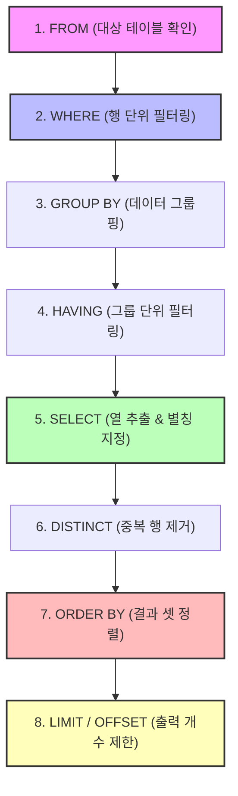
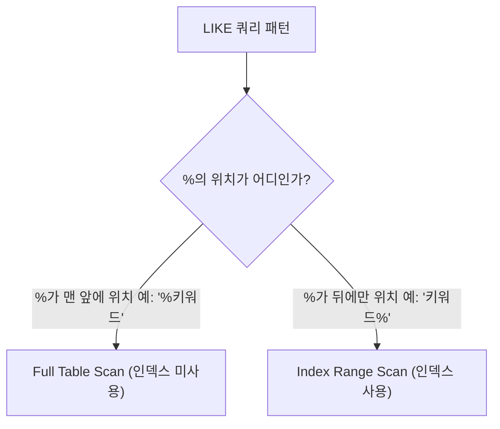

# 📘 SQL DQL 중급 마스터 가이드: 조건 다변화, 정렬, 페이징 (MySQL 기준)

본 가이드는 `step2.sql`에 포함된 기초 SQL 데이터를 분석하여, **DQL(Data Query Language)**의 중급 기능인 **범위 및 집합 연산, 패턴 매칭(LIKE), 데이터 정렬(ORDER BY), 페이징(LIMIT)**을 설명합니다. 초심자의 비유부터 주니어 수준의 RDBMS 설계 원리, 그리고 SQLD 시험 핵심 포인트와 면접 Q&A까지 정리하였습니다.

---

## 📌 목차
1. [SQLD 핵심 요약 & 전체 DQL 논리적 실행 순서](#1-sqld-핵심-요약--전체-dql-논리적-실행-순서)
2. [범위 및 집합 연산: BETWEEN, IN](#2-범위-및-집합-연산-between-in)
3. [패턴 매칭 연산자: LIKE와 와일드카드](#3-패턴-매칭-연산자-like와-와일드카드)
4. [정렬 제어: ORDER BY와 인덱스 스캔](#4-정렬-제어-order-by와-인덱스-스캔)
5. [페이징 아키텍처: LIMIT & OFFSET](#5-페이징-아키텍처-limit--offset)
6. [기술 면접 대비 예상 질문 & 답변 (Q&A)](#6-기술-면접-대비-예상-질문--답변-qa)

---

## 1. SQLD 핵심 요약 & 전체 DQL 논리적 실행 순서

### 💡 SQLD 시험 출제 포인트
* **전체 쿼리 실행 순서**: WHERE 절, SELECT 절, ORDER BY 절뿐만 아니라 데이터 페이징까지 이어지는 전체 흐름을 물어보는 문제가 빈번하게 출제됩니다.
* **IN 연산자와 NULL**: `NOT IN` 구문 내 서브쿼리나 리스트에 `NULL`이 하나라도 포함되어 있을 때 연산 결과가 어떻게 왜곡되는지 묻는 고난도 함정을 조심해야 합니다.

### ⚙️ DQL 전체 논리적 수행 순서 (주니어를 위한 원리)
SQL 쿼리를 작성하는 논리적 문법 순서와 RDBMS 내부에서 한 단계씩 필터링 및 조작을 처리하는 순서는 다음과 같습니다.



* **포인트**: 작성법상 가장 앞인 `SELECT`는 `LIMIT`을 제외하고 거의 가장 마지막 단계(`ORDER BY` 직전)에 평가됩니다. 따라서 `ORDER BY`에서는 `SELECT`에서 지정한 별칭을 활용해 정렬할 수 있지만, `WHERE` 절은 `SELECT`보다 선행되므로 별칭을 사용할 수 없습니다.

---

## 2. 범위 및 집합 연산: BETWEEN, IN

### 🎨 초심자를 위한 비유
* **BETWEEN (범위)**: 놀이공원 롤러코스터 탑승 조건 중 "키 120cm 이상, 150cm 이하의 어린이만 탑승 가능"과 같습니다. 경계값인 120과 150을 **포함(이상/이하)**하여 한 번에 가두는 안전 바(Bar) 역할을 합니다.
* **IN (집합)**: 회원 가입 사은품 목록 중 `[커피쿠폰, 에코백]`이 들어있는 선물 바구니입니다. "네가 고른 사은품이 이 바구니에 들어있니?"라고 한 번에 확인하는 필터입니다.

### 🧪 추상화된 일반 예제
```sql
-- 1. BETWEEN AND를 사용한 범위 검색
SELECT column_name
FROM table_name
WHERE compare_column BETWEEN low_value AND high_value;

-- 2. IN을 사용한 다중 값 일치 여부 판별
SELECT column_name
FROM table_name
WHERE compare_column IN (value_1, value_2, value_3);
```

### 🧠 주니어를 위한 원리 & SQLD 핵심
#### BETWEEN의 등가 조건 확장
옵티마이저는 내부적으로 `BETWEEN low AND high` 문을 다음과 같이 확장해서 실행 계획을 작성합니다.
$$\text{compare\_column} \ge \text{low\_value} \quad \mathbf{AND} \quad \text{compare\_column} \le \text{high\_value}$$
* **주의**: 따라서 SQLD 시험 문제 풀이 시, `BETWEEN 300000 AND 50000`처럼 큰 값을 앞에 기술하면 조건이 무조건 거짓($300000 \le \text{column} \le 50000$은 성립 불가)이 되어 아무것도 조회되지 않습니다.

#### IN 연산자의 내부 변환 및 대형 OR 조건과의 비교
`compare_column IN (A, B)`는 `compare_column = A OR compare_column = B`와 논리적으로 완벽히 동일합니다. 
* **성능적 원리**: `IN` 안에 정적인 상수 리스트가 들어오는 경우, 데이터베이스 엔진은 이 상수들을 정렬(Sort)하여 이진 검색(Binary Search) 방식으로 데이터를 빠르게 판별합니다. 따라서 다량의 `OR` 구문을 장황하게 쓰는 것보다 `IN`을 사용하는 것이 옵티마이저 가독성 및 쿼리 파싱 성능 향상에 긍정적인 영향을 줍니다.

#### ⚠️ SQLD 고난도 함정: NOT IN과 NULL
`NOT IN` 구문 안에 `NULL` 값이 포함되어 있다면, 논리적 법칙에 의해 쿼리는 **항상 공집합(아무 데이터도 조회되지 않음)**을 결과로 반환합니다.
```sql
-- 내부적으로 아래와 같이 AND로 치환됩니다.
col NOT IN (A, NULL) 
=> (col != A) AND (col != NULL)
=> (col != A) AND UNKNOWN  -- NULL과의 모든 비교는 UNKNOWN
=> 결과적으로 최종 논리값이 FALSE/UNKNOWN이 됨
```
* **대비책**: `NOT IN`을 작성하거나 서브쿼리를 연결할 때에는 반드시 대상 컬럼에 `IS NOT NULL` 조건을 걸어 NULL을 사전에 완배제해야 합니다.

---

## 3. 패턴 매칭 연산자: LIKE와 와일드카드

### 🎨 초심자를 위한 비유
* **LIKE (패턴 매칭)**: 스마트폰 주소록 검색창에 초성이나 단어 일부를 검색하는 검색 기능입니다.
* **`%` (와일드카드)**: "길이 상관없음"입니다. `'스마트폰%'`은 '스마트폰', '스마트폰케이스', '스마트폰충전기' 등을 전부 찾아줍니다.
* **`_` (와일드카드)**: "딱 1글자 자리 표시자"입니다. `'갤럭시S__'`는 '갤럭시S24', '갤럭시S22'처럼 S 뒤에 딱 2글자가 붙은 모델만 합격시키고, '갤럭시S'나 '갤럭시S24울트라'는 탈락시킵니다.

### 🧪 추상화된 일반 예제
```sql
-- 1. 지정 문자열이 포함된 모든 행 찾기
SELECT column_name FROM table_name WHERE text_column LIKE '%keyword%';

-- 2. 고정 글자 수 매칭 (앞의 세 글자는 무관하며 네 번째 글자가 '폰'인 데이터)
SELECT column_name FROM table_name WHERE text_column LIKE '___폰%';
```

### 🧠 주니어를 위한 원리 & SQLD 핵심
#### 인덱스 탐색과 LIKE 와일드카드 방향
* RDBMS에 인덱스(B-Tree Index)가 잡혀있어도, `LIKE '%keyword'`와 같이 **와일드카드가 맨 처음에 시작하는 경우** 인덱스를 전혀 사용하지 못하고 **Full Table Scan**을 타게 됩니다. 사전에서 맨 앞 글자가 뭔지 모른 채 마지막 글자가 '폰'인 단어만 찾으려면 사전 첫 페이지부터 끝 페이지까지 전수 검사해야 하는 원리와 같습니다.
* 반면, `LIKE 'keyword%'`와 같이 맨 앞 글자가 고정된 채 뒤에 와일드카드가 붙는 형태는 인덱스 범위 검색(Index Range Scan)이 가능하여 대규모 데이터셋에서도 엄청나게 빠르게 동작합니다.



#### ESCAPE 절 사용법 (SQLD 단골 출제)
와일드카드 기호인 `%`나 `_` 문자 그 자체를 검색해야 할 경우, `ESCAPE` 옵션을 지정하여 일반 문자로 탈락시킬 수 있습니다.
```sql
-- 이름 중간에 언더바 '_'가 포함된 데이터를 찾을 때
SELECT * FROM users
WHERE nickname LIKE '%\_%' ESCAPE '\';
-- 여기서 역슬래시(\) 뒤의 '_'는 와일드카드가 아닌 실제 '_' 기호 자체로 평가됩니다.
```

---

## 4. 정렬 제어: ORDER BY와 인덱스 스캔

### 🎨 초심자를 위한 비유
* **ORDER BY (줄 세우기)**: 군대나 학교에서 키순(오름차순, ASC) 또는 나이순(내림차순, DESC)으로 줄을 서게 제어하는 정렬기입니다. 
* 여러 기준으로 줄을 세울 수도 있습니다. "먼저 성별로(남자, 여자) 1차 정렬한 다음, 성별이 같을 때는 생년월일이 빠른 순(오름차순)으로 2차 정렬해라" 하는 다중 정렬 규칙을 정의하는 것입니다.

### 🧪 추상화된 일반 예제
```sql
-- 1. 단일 컬럼 기준 내림차순(DESC) 정렬
SELECT column_1, column_2
FROM table_name
ORDER BY column_1 DESC;

-- 2. 다중 컬럼 혼합 정렬 (1차 내림차순, 2차 오름차순)
SELECT column_1, column_2, column_3
FROM table_name
ORDER BY column_1 DESC, column_2 ASC;

-- 3. SELECT 절 내 컬럼 순서 인덱스로 정렬 (가시성은 떨어지므로 실무 지양, 시험용)
-- 아래 쿼리는 column_2(2번째)를 기준으로 내림차순 정렬함
SELECT column_1, column_2
FROM table_name
ORDER BY 2 DESC;
```

### 🧠 주니어를 위한 원리 & SQLD 핵심
#### Filesort vs Index Scan의 구조와 비용
사용자가 정렬을 요구하면, RDBMS는 임시 가용 메모리 공간(Sort Buffer)이나 물리 디스크 공간을 할당하여 데이터 정렬 연산을 처리합니다(이를 **Filesort**라고 부름). 이는 서버의 CPU 리소스를 심각하게 소모합니다.

```mermaid
graph TD
    subgraph Filesort (비효율: 정렬 연산 수행)
        A[데이터 전체 스캔] --> B[Sort Buffer 메모리 적재]
        B --> C[퀵 정렬 등의 알고리즘 수행]
        C --> D[정렬 완료 후 클라이언트에 반환]
    end
    subgraph Index Scan (효율: 정렬 연산 제거)
        E[이미 정렬된 인덱스 트리 탐색] --> F[순서대로 리프 블록 읽기]
        F --> G[추가 연산 없이 클라이언트에 반환]
    end
```
* **결론**: 실무 및 면접에서는 정렬 성능 향상을 위해 ORDER BY 대상 컬럼에 복합 인덱스를 적용하여 RDBMS가 정렬 연산을 생략하고 인덱스를 순서대로 읽게 만드는 것(Index Scan)이 모범 답안입니다.

#### ⚠️ SQLD 핵심: DBMS별 NULL 값 정렬 기준 차이
정렬 기준 컬럼에 NULL 값이 섞여있을 때, 이를 최소값으로 볼 것인지 최대값으로 볼 것인지에 대한 정의는 데이터베이스 제품마다 다릅니다.

| DBMS 분류 | NULL 정렬 시 크기 규정 | 오름차순 (ASC) | 내림차순 (DESC) |
| :--- | :--- | :--- | :--- |
| **Oracle** | **가장 큰 값**으로 인식 | 맨 마지막에 배치 | 맨 처음에 배치 |
| **MySQL / PostgreSQL** | **가장 작은 값**으로 인식 | 맨 처음에 배치 | 맨 마지막에 배치 |

> [!TIP]
> Oracle에서는 NULL의 정렬 순서를 직접 제어하기 위해 `ORDER BY col_name ASC NULLS FIRST` 또는 `NULLS LAST` 옵션을 지원하여 강제 조정할 수 있습니다.

---

## 5. 페이징 아키텍처: LIMIT & OFFSET

### 🎨 초심자를 위한 비유
* **LIMIT (페이징)**: 두꺼운 백과사전 전체(`Result Set`)를 한눈에 볼 수 없으므로, 책 아래에 `[1] [2] [3] 페이지` 번호를 달고 한 페이지당 딱 5문장씩만 끊어서 보기 편하게 인쇄해주는 인쇄 커터기입니다.

### 🧪 추상화된 일반 예제
```sql
-- 1. 상위 N개의 결과만 끊어서 가져오기
SELECT column_name
FROM table_name
ORDER BY sort_column DESC
LIMIT 5;

-- 2. OFFSET 지정 페이징 처리 (첫 1행은 건너뛰고 그 다음 5행을 가져옴)
-- 형식: LIMIT offset, row_count (MySQL 전용 간략법)
SELECT column_name
FROM table_name
ORDER BY sort_column DESC
LIMIT 1, 5;

-- 3. ANSI 표준 및 보편적 명시 형태 (LIMIT row_count OFFSET offset)
SELECT column_name
FROM table_name
ORDER BY sort_column DESC
LIMIT 5 OFFSET 1;
```

### 🧠 주니어를 위한 원리 & SQLD 핵심
#### LIMIT & OFFSET의 성능 저하 한계와 No-Offset 기법
* RDBMS에서 `LIMIT 1000000, 10`과 같이 큰 Offset 페이징을 호출하면 내부 엔진은 실제로 디스크에서 1,000,010건의 행을 스캔하여 버퍼로 전부 올립니다. 그 후 앞의 1,000,000건은 그냥 버리고 뒤의 10건만 리턴합니다. 즉, 페이지 번호가 뒤로 갈수록 쿼리 속도가 지수 함수처럼 느려지는 **Offset 지연 현상**이 발생합니다.
* 이를 보완하기 위해 실무에서는 `WHERE id < 마지막조회한ID` 와 같이 식별자 조건을 미리 주고 offset 없이 가져오는 **No-Offset(Cursor-based Paging) 기법**을 설계해야 합니다.

#### DBMS별 페이징 방식의 차이 (SQLD 관점)
* **MySQL**: `LIMIT row_count OFFSET offset`
* **SQL Server**: `OFFSET offset ROWS FETCH NEXT row_count ROWS ONLY`
* **Oracle 11g 이하**: ROWNUM 탑재 인라인 뷰(Double Nested Inline View) 활용
  ```sql
  SELECT * FROM (
      SELECT a.*, ROWNUM rnum FROM (
          SELECT * FROM table_name ORDER BY sort_column
      ) a WHERE ROWNUM <= 10
  ) WHERE rnum > 5;
  ```
* **Oracle 12c+**: ANSI 표준의 `OFFSET ROWS FETCH FIRST` 구문 사용 가능.

---

## 6. 기술 면접 대비 예상 질문 & 답변 (Q&A)

### Q1. LIKE 검색에서 '%단어'와 '단어%'의 DB 물리적 실행 방식 차이와 인덱스 연계 성능에 대해 설명해 주세요.
* **답변**:
  * RDBMS의 B-Tree 인덱스는 데이터를 사전식 순서로 정렬하여 유지합니다.
  * 따라서 `'단어%'`처럼 문자열의 접두사(Prefix)가 명확한 경우에는 정렬된 구조를 이용해 찾고자 하는 시작 지점을 찾아내고 범위 검색을 수행하는 **인덱스 레인지 스캔(Index Range Scan)**이 작동합니다.
  * 그러나 `'%단어'`처럼 와일드카드가 앞에 배치되면 어떤 값부터 시작하는지 알 수 없기 때문에 인덱스 구조를 타지 못하고 테이블의 전체 레코드를 처음부터 끝까지 읽는 **풀 테이블 스캔(Full Table Scan)**을 수행하여 큰 성능 손실이 발생합니다.

---

### Q2. 대용량 테이블에서 `ORDER BY` 절을 남용할 시 발생할 수 있는 문제점과, 이를 최소화하기 위한 인덱스 튜닝 방안을 설명해 주세요.
* **답변**:
  * 인덱스의 도움 없이 `ORDER BY`를 실행하면 RDBMS 옵티마이저는 대상 데이터를 임시 메모리 공간(Sort Buffer)에 저장한 뒤 정렬 작업을 처리합니다(Filesort). 이때 정렬할 데이터 용량이 할당된 버퍼보다 크면 임시 디스크 영역을 활용하므로 I/O 병목이 발생해 서버 응답속도가 급격히 저하됩니다.
  * 이를 개선하기 위해 정렬 기준이 되는 컬럼(여러 개인 경우 복합 인덱스)에 B-Tree 인덱스를 적절히 생성해 주면, 이미 리프 노드가 정렬되어 생성되어 있는 데이터 구조를 그대로 순서대로 읽기만 하는 **인덱스 스캔(Index Scan)**을 유도해 CPU 정렬 비용을 0으로 단축할 수 있습니다.

---

### Q3. RDBMS에서 대규모 데이터 페이징 시 OFFSET의 동작 원리상의 성능 한계를 설명하고, 대체 방안을 제시해 주세요.
* **답변**:
  * `OFFSET N LIMIT M` 구문은 DBMS가 N+M건의 로우를 스캔한 후 N건의 레코드를 폐기하는 오프셋 스킵 연산으로 작동합니다. 따라서 페이지 번호(오프셋)가 커질수록 물리 디스크 I/O 탐색 횟수가 기하급수적으로 늘어나 성능이 저하되는 한계가 있습니다.
  * 이를 보완하기 위해 이전 페이지에서 조회한 마지막 레코드의 식별자(예: `auto_increment id` 혹은 `timestamp`)를 클라이언트가 저장하고 있다가 다음 요청 시 `WHERE id < 마지막_조회된_id` 조건으로 앞 구간을 사전에 필터링하는 **No-Offset(Cursor-based) 페이징 방식**을 구현하여 성능을 일관되게 유지할 수 있습니다.

---

### Q4. SQL의 IN 연산자와 NOT IN 연산자 중 NULL 값을 매칭할 때 발생할 수 있는 잠재적 논리 에러와 주의사항에 대해 답변해 주세요.
* **답변**:
  * `col IN (A, B, NULL)`의 경우, 내부적으로 `col = A OR col = B OR col = NULL`로 연산되어 NULL이 아닌 값들과 매칭되는 데이터는 정상 조회됩니다.
  * 그러나 `col NOT IN (A, B, NULL)`의 경우, 내부 식은 `col != A AND col != B AND col != NULL`이 됩니다. SQL의 3치 논리에 따라 NULL과의 비교(`col != NULL`)는 결과가 `UNKNOWN`이 되며, 전체 식이 `AND`로 묶여있으므로 최종 연산 결과가 결코 참(TRUE)이 될 수 없습니다.
  * 결과적으로 `NOT IN` 리스트 내에 NULL이 존재하면 쿼리는 항상 **결과가 없는 공집합(Empty Set)**을 반환하므로 서비스 오작동의 소지가 있습니다. 예방을 위해 필터 대상 컬럼의 NULL 값을 `IS NOT NULL` 또는 `COALESCE` 함수를 사용해 미리 정제해야 합니다.
