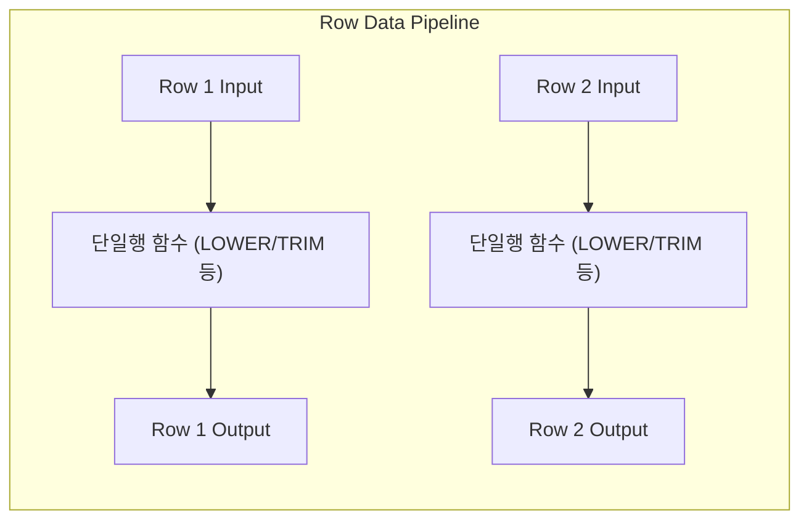
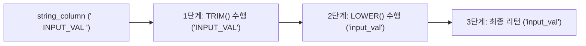

# 📘 SQL DQL 고급 마스터 가이드: NULL 대체, 테이블 조인, 문자열 내장 함수 (MySQL 기준)

본 가이드는 `step3.sql`에 포함된 기초 SQL 데이터를 분석하여, **DQL(Data Query Language)**의 핵심 영역인 **NULL 치환 함수(IFNULL, COALESCE), 테이블 간 등가 조인(Implicit Join), 다양한 내장 문자열 함수(TRIM, SUBSTRING, CONCAT 등)**를 설명합니다. 초심자의 비유부터 주니어 수준의 RDBMS 설계 원리, 그리고 SQLD 시험 핵심 포인트와 면접 Q&A까지 일목요연하게 다룹니다.

---

## 📌 목차
1. [SQLD 핵심 요약 & 내장 함수 분류 체계](#1-sqld-핵심-요약--내장-함수-분류-체계)
2. [NULL 대체와 다단계 구제: IFNULL, COALESCE](#2-null-대체와-다단계-구제-ifnull-coalesce)
3. [테이블 조인의 원리: 묵시적 조인과 Nested Loop Join](#3-테이블-조인의-원리-묵시적-조인과-nested-loop-join)
4. [문자열 내장 함수와 다중 중첩 연산](#4-문자열-내장-함수와-다중-중첩-연산)
5. [기술 면접 대비 예상 질문 & 답변 (Q&A)](#5-기술-면접-대비-예상-질문--답변-qa)

---

## 1. SQLD 핵심 요약 & 내장 함수 분류 체계

### 💡 SQLD 시험 출제 포인트
* **단일 행 함수 vs 다중 행 함수**: 입력된 한 행마다 하나의 결과를 반환하는 단일 행 함수(문자, 숫자, 날짜, 변환, NULL 함수 등)와 여러 행을 그룹 지어 하나의 결과를 내는 다중 행 함수(집계, 그룹 함수 등)의 구분을 정확히 아는 것이 기본 출제 포인트입니다.
* **묵시적 조인의 위험성**: ANSI SQL의 `ON` 절 없이 콤마(`,`)로 테이블을 연결할 때 발생할 수 있는 카티션 곱(Cartesian Product) 현상 및 조인 조건 누락에 따른 데이터 왜곡을 경계해야 합니다.

### 🧩 단일 행 함수의 처리 흐름 (주니어를 위한 원리)
단일 행 함수는 데이터를 조작할 때 각 로우(Row)가 함수라는 파이프라인을 통과하며 독립적으로 1:1 변형이 이루어집니다.



---

## 2. NULL 대체와 다단계 구제: IFNULL, COALESCE

### 🎨 초심자를 위한 비유
* **대체제 백업 플랜**: 카페에서 음료를 주문하려고 합니다.
  * **IFNULL (이원 대체)**: "카페라떼 주문할게요. 혹시 품절(NULL)되었으면 그냥 아메리카노로 대체해서 주세요."
  * **COALESCE (다단계 다원 대체)**: "카페라떼 주세요. 라떼 없으면 카푸치노 주시고, 카푸치노도 없으면 에스프레소 주시고, 그것도 없으면 그냥 물(기본값) 주세요."

### 🧪 추상화된 일반 예제
```sql
-- 1. IFNULL을 사용한 이항 NULL 대체 (MySQL 전용)
SELECT IFNULL(nullable_column, 'default_value')
FROM table_name;

-- 2. COALESCE를 사용한 다단계 가변 인자 NULL 대체 (ANSI 표준)
SELECT COALESCE(nullable_column_1, nullable_column_2, 'fallback_value')
FROM table_name;
```

### 🧠 주니어를 위한 원리 & SQLD 핵심
#### DBMS 제품별 대표적 NULL 처리 단일 행 함수 비교
각 데이터베이스 엔진마다 NULL을 정비하기 위해 독자적으로 제공하는 단일 행 함수가 다릅니다. 이 차이를 반드시 암기해야 교차 문제 풀이가 가능합니다.

| DBMS 종류 | 함수명 | 사용 형태 | 설명 |
| :--- | :--- | :--- | :--- |
| **Oracle** | `NVL` | `NVL(col, val)` | col이 NULL이면 val 반환 |
| **Oracle** | `NVL2` | `NVL2(col, val1, val2)` | col이 NULL이 아니면 val1, NULL이면 val2 반환 |
| **SQL Server** | `ISNULL` | `ISNULL(col, val)` | col이 NULL이면 val 반환 |
| **MySQL** | `IFNULL` | `IFNULL(col, val)` | col이 NULL이면 val 반환 |
| **공통 (ANSI)** | `COALESCE` | `COALESCE(v1, v2, ...)` | 인자 중 **최초로 NULL이 아닌 값**을 찾아 반환 |

#### COALESCE의 다중 컬럼 스캔 메커니즘
`COALESCE` 함수는 앞에서부터 차례대로 값을 스캔하여, `NULL`이 아닌 값이 탐지되는 즉시 그 값을 반환하고 평가를 종료합니다(Short-circuit evaluation과 유사). 모든 인자가 NULL일 경우 최종적으로 NULL을 반환합니다.

---

## 3. 테이블 조인의 원리: 묵시적 조인과 Nested Loop Join

### 🎨 초심자를 위한 비유
* **관계망 연결 (조인)**: '학생 인적사항 테이블'과 '중간고사 성적 테이블'이 따로 흩어져 있습니다. 두 테이블에 공통으로 적혀있는 **'학번(Join Key)'**을 실로 연결하여 학번이 같은 학생의 이름과 수학 성적을 한 장의 가로로 긴 표에 같이 매칭시켜서 보여주는 결합 방식입니다.

### 🧪 추상화된 일반 예제
```sql
-- 1. 묵시적 조인 (Implicit Join - FROM 절에 콤마 사용, WHERE에서 필터)
SELECT t1.column_a, t2.column_b
FROM table_1 t1, table_2 t2
WHERE t1.join_key = t2.join_key;

-- 2. 명시적 조인 (Explicit Join - ANSI 표준 INNER JOIN ON)
SELECT t1.column_a, t2.column_b
FROM table_1 t1
INNER JOIN table_2 t2 ON t1.join_key = t2.join_key;
```

### 🧠 주니어를 위한 원리 & SQLD 핵심
#### Nested Loop Join (NL 조인) 작동 메커니즘
RDBMS가 가장 기본적으로 처리하는 조인 알고리즘은 Nested Loop Join으로, 프로그래밍의 2중 For 루프와 동일하게 동작합니다.

```mermaid
graph TD
    subgraph Driving Table (Outer: table_1)
        A["Row 1 (key=10)"]
        B["Row 2 (key=20)"]
    end
    subgraph Driven Table (Inner: table_2)
        C["Row A (key=10)"]
        D["Row B (key=10)"]
        E["Row C (key=20)"]
    end
    
    A -->|1. Outer 스캔| C
    A -->|2. Outer 스캔| D
    B -->|3. Outer 스캔| E
    
    style A fill:#f9f,stroke:#333,stroke-width:2px
    style C fill:#bfb,stroke:#333,stroke-width:2px
    style D fill:#bfb,stroke:#333,stroke-width:2px
```

1. **드라이빙 테이블(Outer Table)**에서 한 행씩 읽습니다.
2. 각 행의 조인 키 값을 가지고 **드리븐 테이블(Inner Table)**로 가서 일치하는 행을 스캔합니다.
3. **인덱스의 중요성**: 드리븐 테이블의 조인 키 컬럼에 인덱스가 없다면, Outer 테이블의 모든 로우에 대해 Inner 테이블 전체를 풀 스캔하므로 성능이 참사 수준으로 떨어집니다. 따라서 조인 키 컬럼에는 반드시 인덱스를 생성해야 합니다.

#### ⚠️ SQLD 출제 핵심: 카티션 곱 (Cartesian Product)
두 테이블을 조인하면서 조인 조건을 완전히 누락한 경우, 첫 번째 테이블의 모든 행이 두 번째 테이블의 모든 행과 결합하여 수학적 곱집합(M * N 행)을 생성합니다. 이를 **카티션 곱** 또는 **Cross Join**이라고 부르며, 심각한 메모리 오버플로우를 발생시킬 수 있으므로 주의해야 합니다.

---

## 4. 문자열 내장 함수와 다중 중첩 연산

### 🎨 초심자를 위한 비유
* **TRIM**: 우편물을 보낼 때 주소 적는 칸 앞뒤에 실수로 들어간 쓸데없는 스페이스바 빈칸을 지우개로 싹 지워주는 공백 제거기입니다.
* **SUBSTRING**: 주민등록번호 뒷자리에서 첫 번째 글자만 떼어내 성별('1' 또는 '2')을 판별할 때 쓰는 조각 가위입니다.
* **CONCAT**: 명함에 '홍길동'과 '과장'을 합쳐서 '홍길동 과장'으로 글자를 붙여서 인쇄해 주는 풀칠 도구입니다.

### 🧪 추상화된 일반 예제
```sql
-- 1. 공백 제거 및 대소문자 변환 중첩 적용
SELECT LOWER(TRIM(string_column)) AS refined_string
FROM table_name;

-- 2. 부분 문자열 잘라내기 (1번째 글자부터 시작하여 4글자 추출)
SELECT SUBSTRING(string_column, 1, 4)
FROM table_name;

-- 3. 구분자와 함께 여러 문자열 결합 (CONCAT_WS)
-- 출력 형식: value_1 - value_2
SELECT CONCAT_WS(' - ', column_1, column_2)
FROM table_name;
```

### 🧠 주니어를 위한 원리 & SQLD 핵심
#### 중첩 함수의 논리적 평가 방향
SQL 내에서 단일 행 함수들은 중첩(Nesting) 사용이 가능합니다. 이 경우 **가장 안쪽에 위치한 함수부터 먼저 연산**된 결과가 바깥쪽 함수의 인자로 전달되는 구조로 처리됩니다.



#### ⚠️ SQLD 핵심: MySQL과 Oracle의 문자열 연결 연산자 차이
SQLD 자격증 준비 및 다중 RDBMS 운용 시 문자열을 서로 붙이는 연산 방식의 차이를 인지해야 합니다.

* **Oracle**: 파이프 기호 `||`를 사용합니다.
  ```sql
  SELECT first_name || ' ' || last_name FROM employees;
  ```
* **MySQL**: 기본 설정 상태에서 파이프 기호 `||`는 **논리 연산자(OR)**로 간주됩니다.
  ```sql
  -- MySQL에서는 0 또는 1이라는 논리값 결과가 출력되어 문자열 연결이 실패합니다.
  SELECT first_name || ' ' || last_name FROM employees;
  
  -- 올바른 방법: CONCAT() 함수 활용
  SELECT CONCAT(first_name, ' ', last_name) FROM employees;
  ```
  * *참고*: MySQL에서도 `SET sql_mode = 'PIPES_AS_CONCAT';` 명령어를 통해 파이프 기호를 문자열 연결 연산자로 작동하도록 강제할 수 있습니다.

---

## 5. 기술 면접 대비 예상 질문 & 답변 (Q&A)

### Q1. COALESCE 함수와 IFNULL(또는 NVL) 함수의 기능적 차이 및 설계 관점에서의 장단점을 설명해 주세요.
* **답변**:
  * `IFNULL`(MySQL)과 `NVL`(Oracle)은 특정 DBMS에 완전히 종속된 내장 함수로, 반드시 2개의 인자만 받아 첫 번째 값이 NULL이면 두 번째 값을 반환하는 고정형 함수입니다.
  * 반면 `COALESCE`는 ANSI SQL 표준 함수이므로 모든 RDBMS 제품군에서 범용적으로 호환됩니다. 또한 가변 인자를 지원하여 `COALESCE(A, B, C, 'N/A')`와 같이 NULL이 아닌 최초의 대상을 찾기 위해 순차적으로 다단계 검사를 수행할 수 있습니다.
  * 따라서 DBMS 마이그레이션 호환성과 다중 컬럼에 대한 예외 대처 구조를 유연하게 구축하기 위해서는 표준 함수인 `COALESCE` 사용이 권장됩니다.

---

### Q2. 묵시적 조인(Implicit Join)과 ANSI 표준 조인(Explicit Join)의 차이점 및 실무에서 ANSI 표준 조인을 강력히 권장하는 이유를 설명해 주세요.
* **답변**:
  * 묵시적 조인은 FROM 절에 테이블들을 쉼표(`,`)로 열거하고 WHERE 절에 조인 조건을 배치하는 고전적 방식이며, 명시적 조인은 FROM 절에 `INNER JOIN` 키워드와 조인 조건 평가식인 `ON` 절을 명시합니다.
  * ANSI 조인을 권장하는 이유는 **가독성과 유지보수성, 그리고 에러 방지** 때문입니다. 묵시적 조인은 쿼리가 복잡해지면 일반 필터링 조건과 조인 매칭 조건이 WHERE 절에 무분별하게 혼재되어 결합 오류를 찾기 어렵습니다.
  * 또한 실수로 WHERE 절의 조인 조건을 누락했을 때 카티션 곱(Cartesian Product) 오작동이 유발되는 반면, 명시적 조인은 조인 조건(`ON`)을 적지 않으면 문법 오류(Syntax Error)를 사전에 뿜어내어 시스템 장애를 방지합니다.

---

### Q3. RDBMS의 Nested Loop Join 작동 과정에서 Driving 테이블과 Driven 테이블의 정의와 인덱스가 성능에 미치는 물리적 영향에 대해 설명해 주세요.
* **답변**:
  * Nested Loop Join은 바깥 For 루프를 돌며 스캔 기준이 되는 **드라이빙 테이블(Driving/Outer Table)**과, 안쪽 For 루프를 돌며 키 값을 매칭시키는 **드리븐 테이블(Driven/Inner Table)**로 나뉩니다.
  * 드라이빙 테이블의 각 행마다 드리븐 테이블 전체 데이터를 탐색해야 하므로, 드리븐 테이블의 조인 키 컬럼에는 반드시 **B-Tree 인덱스**가 걸려 있어야 합니다. 인덱스가 있다면 이중 반복 루프 속에서도 매번 풀 스캔하는 대신 O(log N)의 인덱스 검색(Index Scan)으로 매칭 로우를 즉각 수색할 수 있습니다.
  * 일반적으로 옵티마이저는 WHERE 조건 필터에 의해 걸러진 행의 수가 더 적은 테이블을 드라이빙 테이블로 선정하여 내부 루프 회전수 자체를 최소화하도록 최적화합니다.

---

### Q4. MySQL에서 `SELECT 'A' || 'B';` 실행 시 기대하는 문자열 'AB' 대신 `0` 또는 `1`이 출력되는 컴퓨터 과학적 원인과 해결 방안을 답변해 주세요.
* **답변**:
  * SQL 표준에서 파이프 기호 `||`는 문자열 결합 연산자로 명시되어 있으나, MySQL은 전통적으로 이를 논리 연산자인 `OR`와 동일하게 파싱하도록 기본 예약어 파서 규칙이 설계되어 있기 때문입니다.
  * 문자열 `'A'`와 `'B'`는 Boolean 컨텍스트에서 둘 다 거짓(FALSE, 0) 또는 비수치 데이터로 평가되어 `0 OR 0` 연산이 적용되므로 최종 결과값으로 `0`이 도출됩니다.
  * 이를 해결하려면 문자열 결합용 내장 함수인 **`CONCAT()`** 또는 **`CONCAT_WS()`**를 사용해야 하며, Oracle과의 호환성 및 표준 SQL 작성을 강제하고 싶다면 MySQL의 시스템 변수인 `sql_mode`에 **`PIPES_AS_CONCAT`** 옵션을 영구적으로 추가하여 `||` 기호가 결합 연산자로 작동하게끔 교정해야 합니다.
