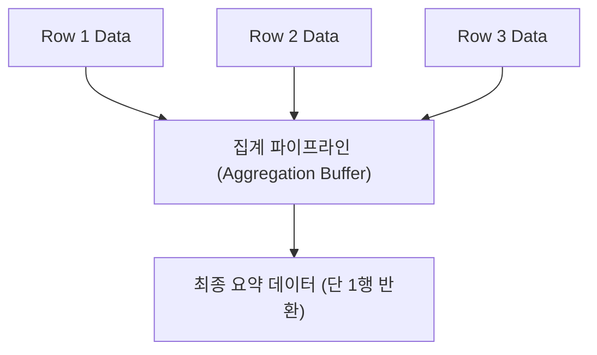
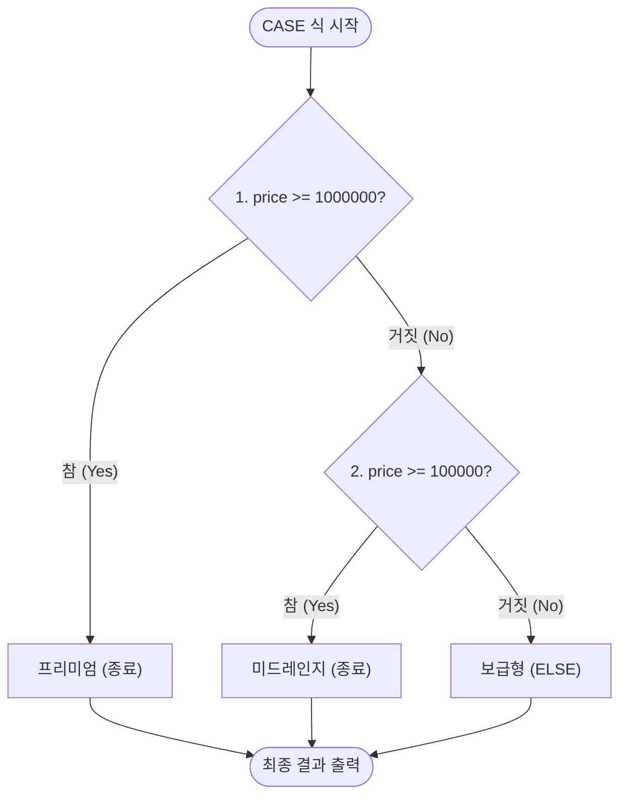
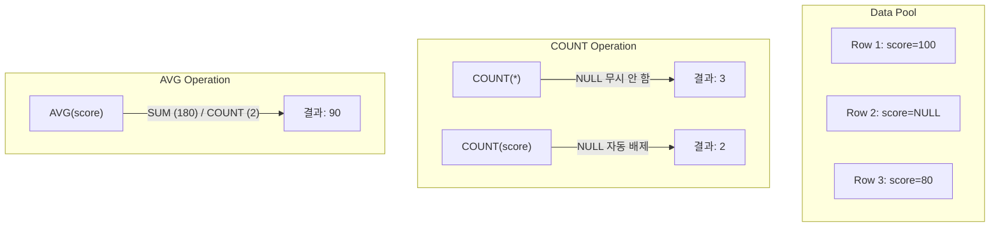

# 📘 SQL DQL 고급 마스터 가이드: 조건 분기(CASE/IF) 및 집계 함수 (MySQL 기준)

본 가이드는 `step4.sql`에 포함된 기초 SQL 데이터를 분석하여, **DQL(Data Query Language)**의 핵심 영역인 **조건부 분기 연산(CASE 문, IF 함수)과 다중 행 집계 함수(COUNT, SUM, AVG, MAX, MIN)**를 설명합니다. 초심자의 비유부터 주니어 수준의 RDBMS 설계 원리, 그리고 SQLD 시험 핵심 포인트와 면접 Q&A까지 밀도 있게 다룹니다.

---

## 📌 목차
1. [SQLD 핵심 요약 & 실행 아키텍처](#1-sqld-핵심-요약--실행-아키텍처)
2. [조건부 분기 제어: CASE 식 & IF 함수](#2-조건부-분기-제어-case-식--if-함수)
3. [다중 행 집계 함수: COUNT, SUM, AVG, MAX, MIN](#3-다중-행-집계-함수-count-sum-avg-max-min)
4. [집계 함수와 NULL의 수학적 관계 공식](#4-집계-함수와-null의-수학적-관계-공식)
5. [기술 면접 대비 예상 질문 & 답변 (Q&A)](#5-기술-면접-대비-예상-질문--답변-qa)

---

## 1. SQLD 핵심 요약 & 실행 아키텍처

### 💡 SQLD 시험 출제 포인트
* **CASE 문과 Oracle DECODE**: 표준 ANSI SQL CASE 문을 Oracle 독자 함수인 `DECODE`로 논리적 결점 없이 완전히 1:1 변환할 수 있는 능력을 테스트하는 문제가 매회 출제됩니다.
* **공집합에 대한 집계 함수 연산 결과**: 조회 쿼리의 만족 로우가 0건인 '공집합(Empty Set)' 상태일 때, 각 집계 함수들이 `0`을 뱉는지 `NULL`을 뱉는지 명확하게 구분하여 암기해야 합니다.

### ⚙️ 집계 함수(Aggregate Function)의 메모리 처리 (주니어를 위한 원리)
단일 행 함수는 데이터를 한 행씩 읽어 즉시 변환하지만, 집계 함수는 여러 행의 데이터를 일시적으로 메모리에 버퍼링한 뒤 하나의 통계 요약값으로 축약(Aggregation) 처리합니다.



---

## 2. 조건부 분기 제어: CASE 식 & IF 함수

### 🎨 초심자를 위한 비유
* **CASE 문 (학점 계산기)**: 학생들의 점수를 받아 등급을 매깁니다. "90점 이상이면 프리미엄(A학점), 80점 이상이면 미드레인지(B학점), 그것도 아니면 보급형(C학점)"을 순서대로 판별하여 결과 라벨을 인쇄해 줍니다.
* **IF 함수 (예/아니오 스티커)**: "이름에 '아이폰'이 적혀있나요? 맞으면 '애플' 스티커를 붙이고, 틀리면 '삼성' 스티커를 붙이세요." 와 같은 3항 조건 필터입니다.

### 🧪 추상화된 일반 예제
```sql
-- 1. 검색형 CASE 식 (Searched CASE - 조건 범위 지정에 적합)
SELECT column_name,
       CASE
           WHEN compare_column >= 1000000 THEN 'Grade A'
           WHEN compare_column >= 100000  THEN 'Grade B'
           ELSE 'Grade C'
       END AS result_label
FROM table_name;

-- 2. 단순형 CASE 식 (Simple CASE - 특정 값 매칭에 적합)
SELECT column_name,
       CASE compare_column
           WHEN 'Value A' THEN 'John'
           WHEN 'Value B' THEN 'Jane'
           ELSE 'Chris'
       END AS staff_label
FROM table_name;

-- 3. IF 및 중첩 IF 함수 사용 (MySQL 전용)
SELECT column_name,
       IF(compare_column LIKE '%apple%', 'iOS', IF(compare_column LIKE '%android%', 'Android', 'Other')) AS os_label
FROM table_name;
```

### 🧠 주니어를 위한 원리 & SQLD 핵심
#### CASE 식 평가 순서와 단락 평가 (Short-circuit Evaluation)
CASE 문은 위에서 아래로 기술된 `WHEN` 조건문을 순차적으로 검증합니다.
* **중요**: **가장 먼저 참(TRUE)으로 판명되는 `WHEN` 절을 마주하는 즉시** 그에 대응하는 `THEN`의 반환값을 결정하고 CASE 평가를 즉시 종료합니다.
* **실수 주의**: 만약 조건의 범위를 잘못 짜면 하위 조건이 씹히는 로직 버그가 발생합니다.
  ```sql
  -- 버그 예시: 1,500,000원인 상품은 100,000원 조건에 먼저 참이 되므로 '미드레인지'로 오평가됨
  WHEN price >= 100000 THEN '미드레인지'
  WHEN price >= 1000000 THEN '프리미엄'
  ```



#### SQLD 핵심 암기: ELSE 생략의 파장
CASE 식에서 `ELSE` 절을 생략했는데 위의 모든 `WHEN` 조건에 거짓(FALSE)으로 평가된 경우, RDBMS는 에러를 내지 않고 **`NULL`**을 리턴합니다. 시스템 안정성을 위해 특수한 상황이 아니라면 예외 복구 목적의 `ELSE` 처리를 해주는 것을 적극 권장합니다.

---

## 3. 다중 행 집계 함수: COUNT, SUM, AVG, MAX, MIN

### 🎨 초심자를 위한 비유
* **집계 (계산기)**: 학급의 모든 성적 목록을 전수 조사합니다.
  * `COUNT(*)`: "오늘 출석한 학생이 총 몇 명이지? (결석생/공석 포함 총 인원수)"
  * `COUNT(score)`: "오늘 수학 시험을 치러서 성적이 정상 입력된 학생은 몇 명이지? (결석해서 NULL인 학생은 카운트 안 함)"
  * `AVG(score)`: "시험에 통과하여 점수가 있는 학생들의 평균 점수는 몇 점이지?"

### 🧪 추상화된 일반 예제
```sql
-- 테이블의 다양한 집계 요약 지표 산출
SELECT COUNT(*),                 -- NULL 포함 전체 행 개수
       COUNT(column_name),       -- NULL 제외 행 개수
       COUNT(DISTINCT column),   -- NULL 제외, 중복 제외 고유 값 개수
       SUM(numeric_column),      -- NULL 제외 총합
       AVG(numeric_column),      -- NULL 제외 평균
       MAX(numeric_column),      -- NULL 제외 최대값
       MIN(numeric_column)       -- NULL 제외 최소값
FROM table_name;
```

---

## 4. 집계 함수와 NULL의 수학적 관계 공식

### 🧠 주니어를 위한 원리 & SQLD 핵심

#### 1. 집계 연산의 NULL 값 무조건 배제 (Ignore) 규칙
RDBMS의 모든 그룹/집계 함수는 **NULL 값을 연산 대상에서 사전에 배제**하고 연산합니다. 

* **예외**: 오직 `COUNT(*)`만 테이블의 행 자체를 세므로 NULL을 포함한 행수를 반환합니다.
* **AVG의 비밀**: `AVG(score)`는 단순 수학적 평균인 `SUM(score) / COUNT(*)`와 동일하지 않습니다. `AVG(score)`는 내부적으로 **`SUM(score) / COUNT(score)`**로 연산되기 때문에 결시자(NULL)를 분모에서 자동 배제합니다. 결시자를 0점 처리하여 전체 인원수로 나누고자 한다면 아래와 같이 `IFNULL` 등을 감싼 뒤 계산해야 합니다.
  ```sql
  -- 결시자(NULL)를 0점으로 수렴한 후 전체 분모로 평균 계산
  AVG(IFNULL(score, 0))
  ```



#### 2. 공집합(Empty Set) 조회 시 집계 함수 출력값
아래 표는 조건식에 맞는 행이 0개인 공집합 대상 쿼리의 출력 결과입니다. 이는 시험 및 자격증에 100% 출제되는 단골 영역입니다.

| 집계 함수 식 | 평가할 대상 데이터 없음 (공집합) | 설명 |
| :--- | :--- | :--- |
| `SELECT COUNT(*)` | **`0`** | 센 행이 없으므로 당연히 0을 리턴함 |
| `SELECT COUNT(col)` | **`0`** | 센 행이 없으므로 당연히 0을 리턴함 |
| `SELECT SUM(col)` | **`NULL`** | 합산할 대상 자체가 부재하므로 알 수 없는 NULL 리턴 |
| `SELECT AVG(col)` | **`NULL`** | 평균 연산 대상이 없으므로 NULL 리턴 |
| `SELECT MAX(col)` | **`NULL`** | 최대값을 추출할 데이터가 없어 NULL 리턴 |
| `SELECT MIN(col)` | **`NULL`** | 최소값을 추출할 데이터가 없어 NULL 리턴 |

---

## 5. 기술 면접 대비 예상 질문 & 답변 (Q&A)

### Q1. CASE 문에서 `ELSE` 절을 기술하지 않았을 때 발생할 수 있는 잠재적 위험성과 이를 RDBMS가 어떻게 처리하는지 컴퓨터 과학적으로 설명해 주세요.
* **답변**:
  * CASE 문은 순차적으로 `WHEN` 조건문을 평가하여 매칭되는 것이 없을 때 `ELSE` 절의 기본값(Default)을 최종 반환하도록 규정되어 있습니다.
  * 만약 개발자가 `ELSE` 절을 의도적 혹은 실수로 작성하지 않은 상황에서 조건에 모두 불합치할 경우, RDBMS는 내부적으로 **`NULL`**을 리턴합니다.
  * 이로 인해 NOT NULL 제약이 걸려있는 컬럼에 CASE 반환값을 삽입하려다 무결성 제약 위배 에러가 터지거나, 연산 중 NULL이 흘러 들어가 예상치 못한 수치 계산 누락 장애가 발생할 수 있습니다. 따라서 안전한 복구 값을 보장하기 위해 `ELSE` 절은 가급적 항상 명시하는 설계가 권장됩니다.

---

### Q2. SQL 집계 함수에서 NULL이 배제(Ignore)되는 규칙이 `AVG()` 연산 시 미치는 영향과, 결손 데이터를 보정하여 전체 평균을 내는 쿼리 구현법을 답변해 주세요.
* **답변**:
  * 집계 함수 `AVG(col)`는 NULL 컬럼이 존재하는 행을 분모(건수)와 분자(총합) 모두에서 배제하고 연산합니다. 즉, 수학적으로 `SUM(col) / COUNT(col)`로 변환되어 실행됩니다.
  * 만약 결시생이나 미입력 항목을 0으로 간주하여 전체 모수 기준의 평균을 구해야 하는 경우, 단순히 `AVG(col)`를 쓰면 평균값이 크게 과대평가되는 로직 오류가 생깁니다.
  * 이를 교정하기 위해서는 단일 행 함수인 `IFNULL` 또는 `COALESCE`를 사용하여 NULL 값을 사전에 0으로 변환해 적재한 후 집계를 태우는 `AVG(IFNULL(col, 0))` 방식을 채택하여 보정해야 합니다.

---

### Q3. Oracle의 `DECODE` 함수와 ANSI SQL 표준의 `CASE` 식의 차이점 및 이식성(Portability) 관점에서의 장단점을 설명해 주세요.
* **답변**:
  * `DECODE` 함수는 Oracle RDBMS 전용 함수로, 값의 동등 비교(`=`)만 수행하는 한계가 있으며 가독성이 떨어집니다. 반면 `CASE` 식은 ANSI SQL 표준 문법으로 동등 비교는 물론 범위 연산 및 복합 논리 연산(`AND`, `OR`, `LIKE` 등)을 `WHEN` 절에 유연하게 적용할 수 있습니다.
  * 이식성 관점에서 `DECODE`를 남용한 SQL 쿼리는 PostgreSQL이나 MySQL 등 타 기종 데이터베이스 마이그레이션 시 전면 수정해야 하는 비용적 리스크를 유발합니다. 따라서 현대 RDBMS 아키텍처 환경에서는 모든 엔진에서 호환되는 `CASE` 문 작성이 표준 가이드라인으로 통용됩니다.

---

### Q4. 특정 조건으로 필터링한 결과 행이 0건일 때(공집합), `SELECT SUM(price)`와 `SELECT COUNT(*)`의 최종 반환 값 차이를 기술하고 그 원인을 설명해 주세요.
* **답변**:
  * 결과가 공집합일 때, `COUNT(*)`는 집계한 행 수가 존재하지 않음을 숫자 **`0`**으로 명확하게 반환합니다.
  * 반면 `SUM(price)`는 수치 연산을 진행할 원본 데이터 블록 자체가 하나도 성립하지 않았으므로, 수집할 수 없는 미지의 의미인 **`NULL`**을 결과 셋으로 반환합니다.
  * 이로 인해 웹 어플리케이션 단에서 `0`을 기대하고 리턴받은 NULL 데이터를 바인딩하다가 NullPointerException(NPE)이 유발될 수 있으므로, 공집합 가능성이 있는 쿼리는 `COALESCE(SUM(price), 0)` 형태로 감싸서 0을 반환하도록 설계하는 예외 방지 처리가 필수적입니다.
